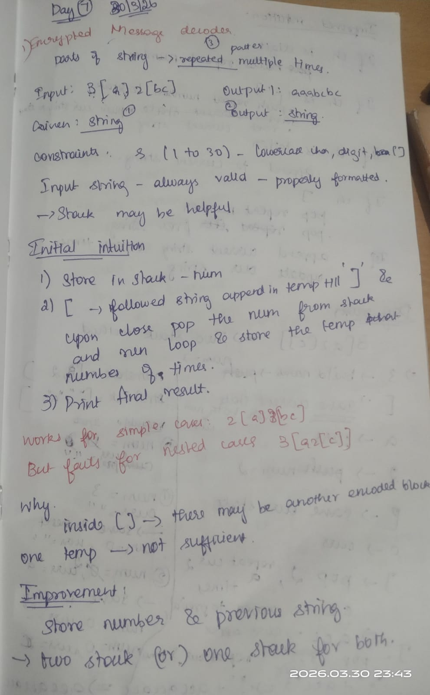
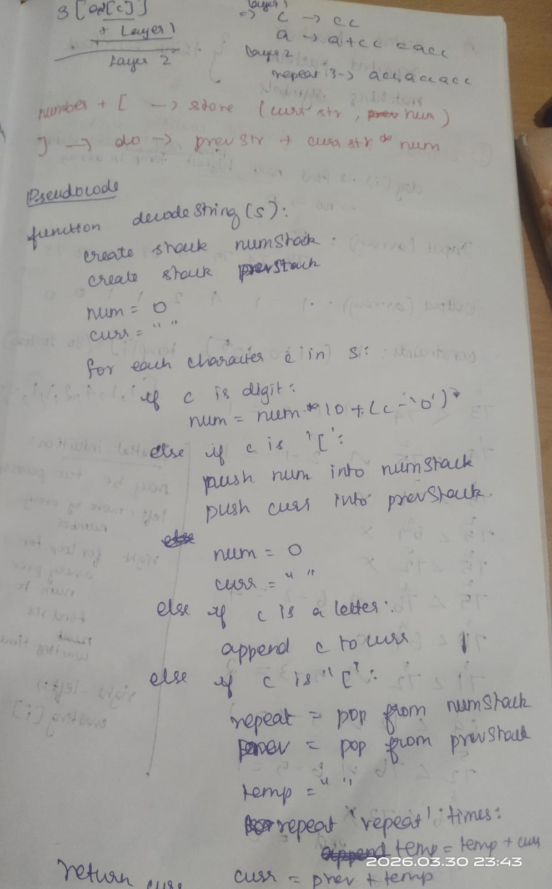
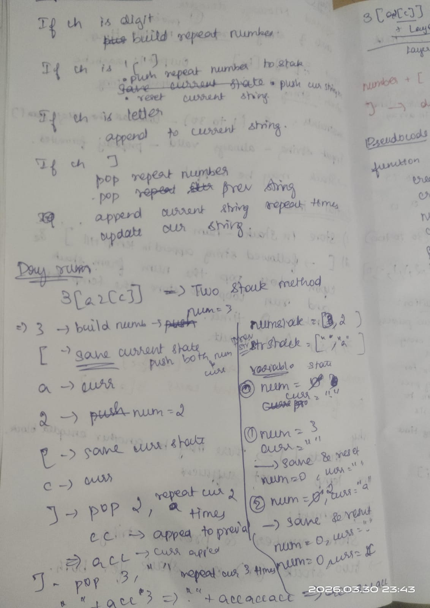
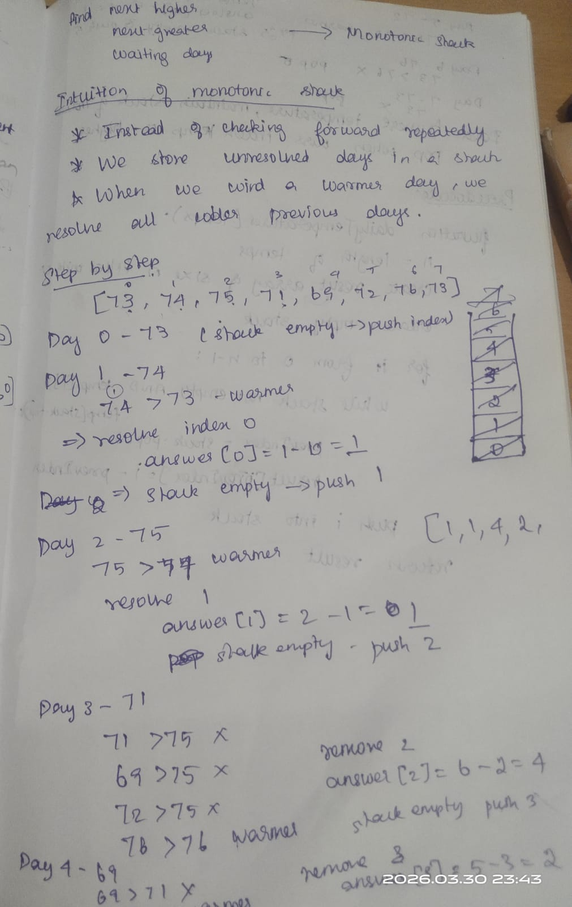
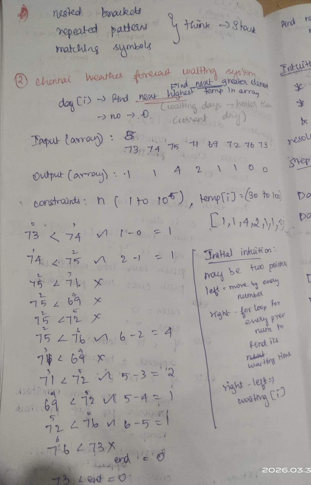
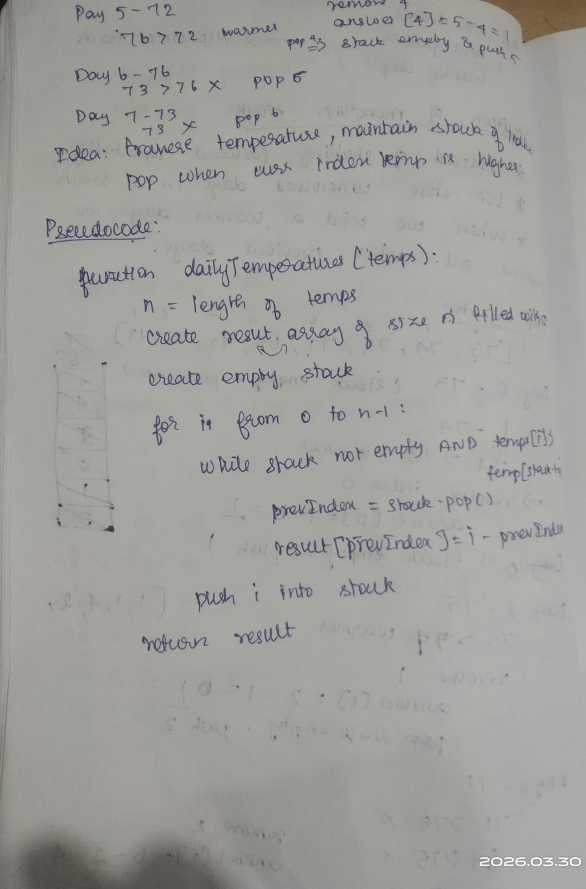

# 📝 Daily Notes - 2026-03-30

---

## 1️⃣ Encrypted Message Decoder

**Pattern:** Stack + StringBuilder  

**Problem Recap:**  
Decode strings with nested patterns like `3[a2[c]]` → `accaccacc`. Supports multi-digit numbers and nested brackets.  

**Core Idea / Tricks:**  
- Use `StringBuilder` to avoid repeated string concatenation  
- Maintain **two stacks**:
  1. **numStack** → stores repeat counts  
  2. **prevStack** → stores previously built string segments  
- Push current number and string when `[` encountered  
- Pop number & previous string on `]` and append repeated substring  

**Dry Run Example:**  
Input: `"3[a2[c]]"`  

| Step | Char | Action | curr | num | numStack | prevStack |
|------|------|--------|------|-----|----------|-----------|
| 1    | `3`  | num=3 | ""   | 3   | []       | []        |
| 2    | `[`  | push num & curr | "" | 0 | [3] | [""] |
| 3    | `a`  | append to curr | "a" | 0 | [3] | [""] |
| 4    | `2`  | num=2 | "a" | 2 | [3] | [""] |
| 5    | `[`  | push num & curr | "" | 0 | [3,2] | ["","a"] |
| 6    | `c`  | append to curr | "c" | 0 | [3,2] | ["","a"] |
| 7    | `]`  | repeat curr 2x & append prev | "acc" | 0 | [3] | [""] |
| 8    | `]`  | repeat curr 3x & append prev | "accaccacc" | 0 | [] | [] |

Output: `"accaccacc"` ✅  

**Pseudocode:**
```text
create numStack, prevStack
curr = ""
num = 0
for char in s:
    if digit → num = num*10 + digit
    if '[' → push num & curr; reset num & curr
    if letter → append to curr
    if ']' → pop num & prev; curr = prev + (curr repeated num times)
return curr

---

## 2️⃣ Chennai Weather Forecasting System

**Pattern:** Monotonic Stack  

**Problem Recap:**  
For each day, find how many days you need to wait for a warmer temperature.  

**Core Idea / Tricks:**  
- Use a **stack to store indices**, not values  
- Pop stack when current temp > temp at stack top → calculate wait days  
- Push current index onto stack  
- Handles O(n) time complexity  

**Dry Run Example:**  
Input: `[73, 74, 75, 71, 69, 72, 76, 73]`  

| i | Temp | Stack Before | Action | Answer Array |
|---|------|--------------|--------|--------------|
| 0 | 73   | []           | push 0 | [0,0,0,0,0,0,0,0] |
| 1 | 74   | [0]          | pop 0 → 1-0=1 | [1,0,0,0,0,0,0,0]; push 1 |
| 2 | 75   | [1]          | pop 1 → 2-1=1 | [1,1,0,0,0,0,0,0]; push 2 |
| 3 | 71   | [2]          | push 3 | [1,1,0,0,0,0,0,0] |
| 4 | 69   | [2,3]        | push 4 | [1,1,0,0,0,0,0,0] |
| 5 | 72   | [2,3,4]      | pop 4 → 5-4=1, pop 3 → 5-3=2 | [1,1,0,2,1,0,0,0]; push 5 |
| 6 | 76   | [2,5]        | pop 5 → 6-5=1, pop 2 → 6-2=4 | [1,1,4,2,1,1,0,0]; push 6 |
| 7 | 73   | [6]          | push 7 | [1,1,4,2,1,1,0,0] |

Output: `[1, 1, 4, 2, 1, 1, 0, 0]` ✅  

**Pseudocode:**
```text
stack = empty
answer = array of size n with 0
for i=0..n-1:
    while stack not empty and temps[i] > temps[stack.top]:
        idx = stack.pop()
        answer[idx] = i - idx
    stack.push(i)
print answer

<p float="left">
  
  
  
  
  
  
</p>